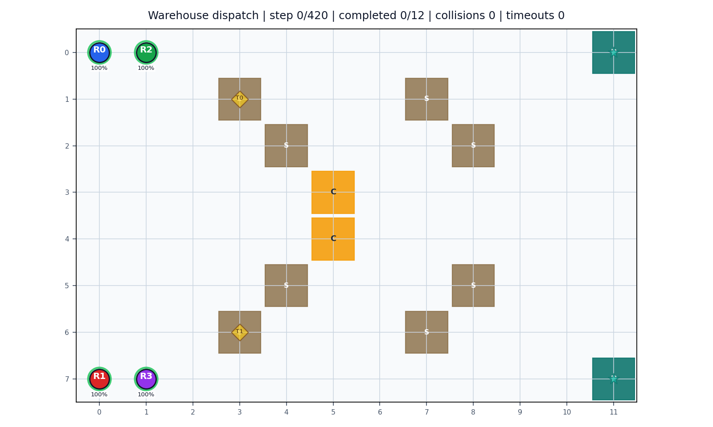
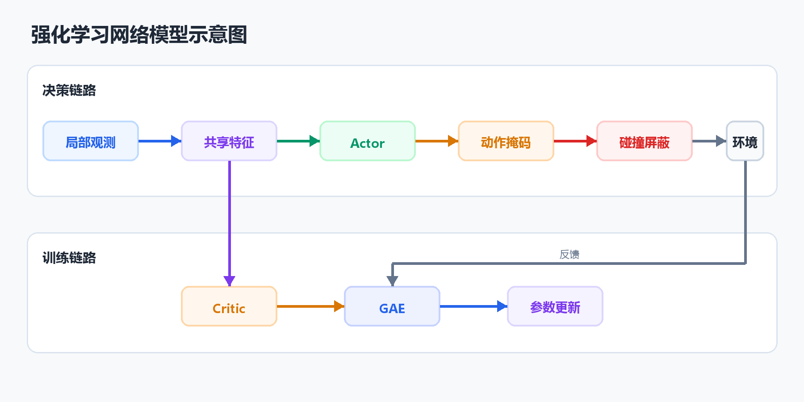
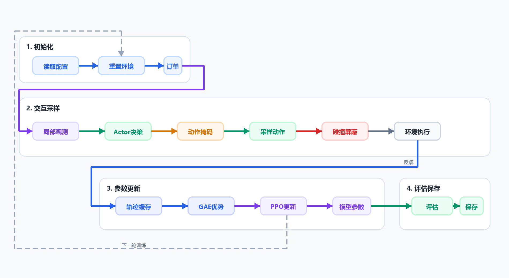
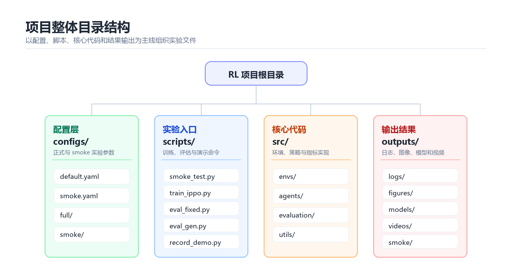
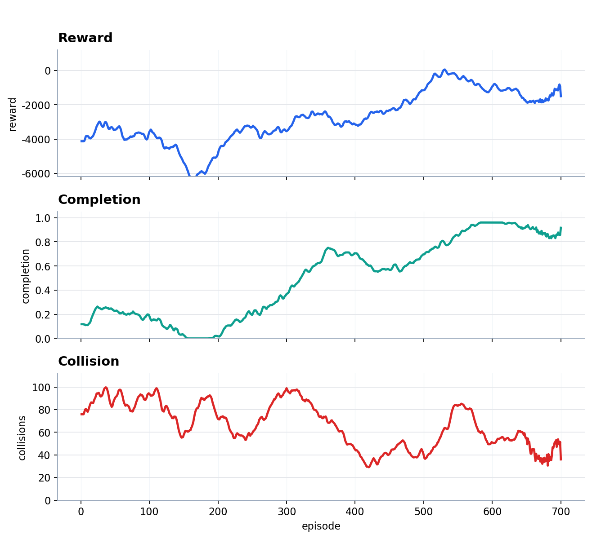
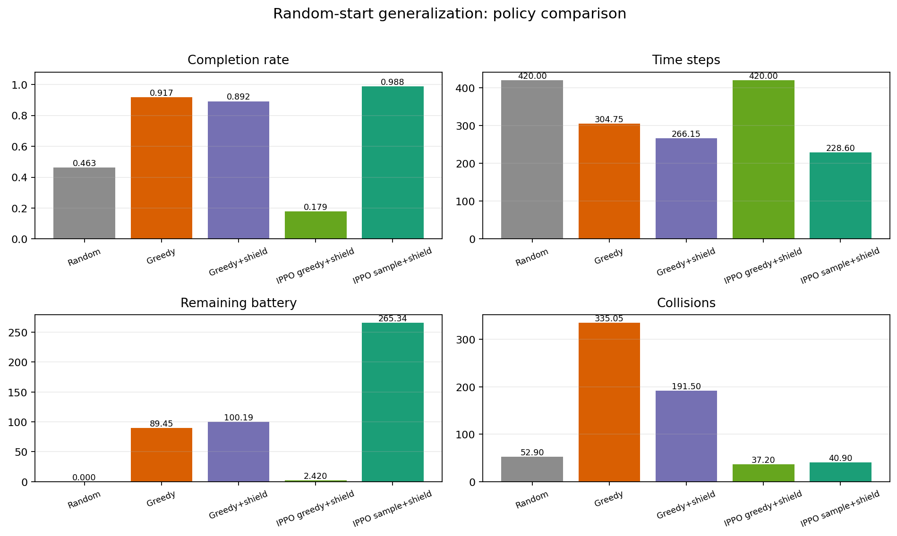
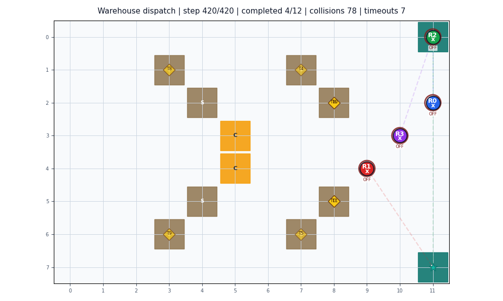
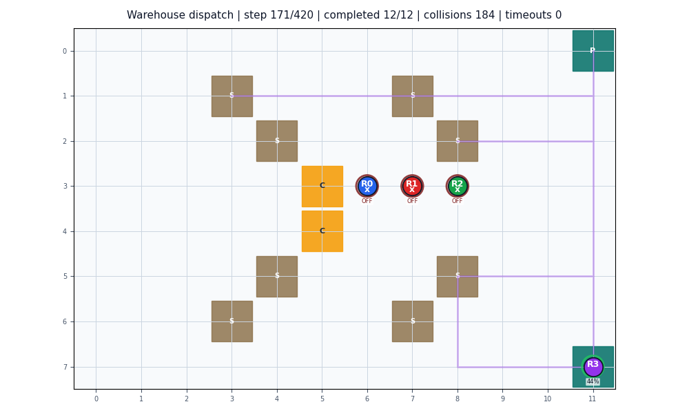
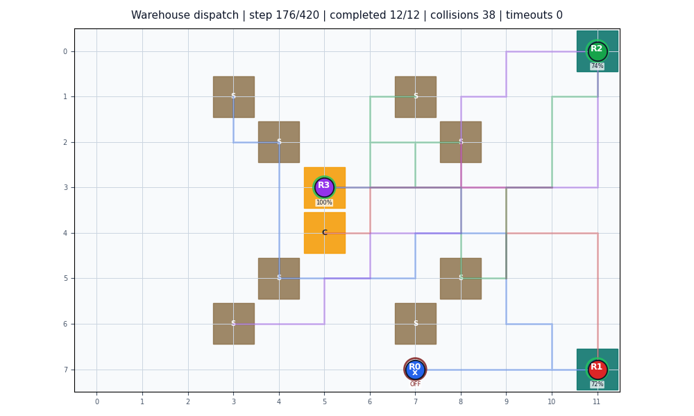

# 智能仓储多机器人协同调度

## 摘要

本项目面向智能仓储中的多机器人拣货调度问题，构建了一个可训练、可评估、可视化的二维网格仿真系统。实验环境包含 4 个机器人、12 个动态释放订单、2 个打包台和 2 个充电站。机器人需要在有限步数和有限电量下完成取货、送货、避碰、等待和充电等操作。

实验对比了 Random、Greedy、Greedy+shield、IPPO greedy+shield 和 IPPO sample+shield 五种策略，并从订单完成率、优先级完成率、时间步、能耗、安全性、任务超时和平均奖励等角度进行评价。算法设计上，IPPO 使用共享 actor-critic 网络，并结合动作 mask、collision shield 和候选轨迹采样，降低无效动作和多机器人冲突。

实验结果表明，在 20 组训练未见随机起点上，`IPPO sample+shield` 的订单完成率达到 `0.9875`，优先级加权完成率达到 `0.9867`，平均碰撞次数为 `40.90`，平均剩余电量为 `265.34`。相比之下，Greedy 虽然完成率达到 `0.9167`，但平均碰撞次数达到 `335.05`。综合来看，强化学习策略在加入安全约束和候选采样后，在当前仓储调度任务中取得了更均衡的表现。

**关键词**：智能仓储；多机器人调度；强化学习；IPPO；PPO；碰撞规避；任务分配

## 第一章 绪论

### 1.1 研究背景

随着物流自动化技术的不断发展，智能仓储系统已经成为现代供应链中的重要组成部分。在典型的智能仓储场景中，多个移动机器人需要在同一物理空间内协同完成拣货、送货和自主充电等任务。与传统的单机器人路径规划不同，多机器人协同调度不仅要判断单个机器人能否顺利到达目标位置，还需要处理多个机器人在时间和空间上的相互影响。

在实际仓储运行过程中，局部资源竞争十分常见。例如，当多个机器人同时前往同一货架区域或打包台时，很容易在狭窄通道和交汇区域发生阻塞。如果调度系统缺少整体协调，只让每个机器人按照自身最短路径行动，从单个机器人看似乎是局部最优，但从系统整体来看，可能会带来更多碰撞、排队等待和无效移动，进而降低仓库的整体运行效率。

因此，智能仓储调度问题本质上是一个带有多重约束的多智能体序列决策问题。一个有效的调度系统需要在动态环境中同时考虑任务分配、路径选择、碰撞规避、电量管理、订单优先级和截止时间等因素。面对这类高动态、强耦合的决策任务，完全依赖人工规则往往难以覆盖所有情况。强化学习为解决该问题提供了一种可行思路：智能体可以通过与环境的反复交互学习调度策略，在任务完成效率、安全性和资源消耗之间形成更合理的权衡。

### 1.2 项目目标

本项目的目标是构建一个面向课程实践的智能仓储多机器人调度系统，并通过强化学习方法研究机器人在复杂仓储环境中的任务分配、路径选择和避碰行为。项目并不只关注单个机器人能否从起点走到终点，而是希望在一个包含动态订单、电量约束、碰撞风险和任务优先级的环境中，观察不同策略在整体调度效果上的差异。

围绕这一目标，项目主要完成以下几方面工作：

1. 构建二维仓储网格环境，模拟多个机器人在共享空间内执行动态释放的订单任务。环境中包含货架服务点、打包台、充电站以及机器人初始位置等基本元素，使仿真场景能够反映真实仓储中的空间竞争关系。
2. 建立包含任务优先级、截止时间、电量消耗、碰撞风险和等待成本的调度模型。机器人不仅需要完成取货和送货，还需要在低电量时考虑充电，在多机器人密集区域中减少冲突。
3. 实现可对比的策略方法，包括随机策略、启发式 Greedy 策略以及基于 IPPO 的强化学习策略。通过 baseline 对比，可以判断强化学习策略相对于简单规则方法是否真正带来改进。
4. 设计与仓储目标相匹配的奖励函数，使 agent 在训练过程中同时关注订单完成、任务优先级、路径效率、安全性和能耗，而不是只追求单一指标。
5. 建立完整的实验评估流程，输出训练日志、固定起点评估、随机起点泛化评估、性能图和运行 GIF。通过完成率、优先级完成率、平均步数、剩余电量、碰撞次数和超时任务数等指标，对不同策略进行综合分析。
6. 通过可视化结果展示策略行为差异，使机器人从随机移动、局部贪心到学习型调度的变化过程能够被直观看到。

后文将围绕当前项目的真实代码、配置和实验输出，依次说明模型假设、算法设计、系统实现、仿真设置、性能评估和最终结论。

## 第二章 网络模型与基本假设

### 2.1 仓储环境设定

正式实验使用 `12 x 8` 的二维网格地图来模拟智能仓储空间。网格中的每一个坐标都表示仓库中的一个离散位置，可以对应通道、货架服务点、打包台、充电站或机器人当前位置。采用网格化建模的好处是状态转移清晰、碰撞判断直接，也便于后续绘制机器人路径和生成运行 GIF。环境参数来自 `configs/full/env.yaml`，该配置文件定义了地图尺寸、机器人数量、任务队列、功能区域和电量相关参数。

在该环境中，机器人从左侧或中部区域出发，需要前往不同货架服务点完成取货，再将货物送到右侧的打包台。订单不是一次性全部出现，而是按时间逐步释放，因此机器人在决策时既要处理当前已释放任务，也要受到后续动态任务流的影响。环境还设置了充电站和电量阈值，使机器人不能只考虑最短路径，还必须兼顾电量消耗和补能时机。

| 项目 | 设置 |
|---|---:|
| 地图尺寸 | `12 x 8` |
| 机器人数量 | `4` |
| 最大步数 | `420` |
| 初始电量 | `120` |
| 低电量阈值 | `0.35` |
| 充电速率 | `9` |
| 货架服务点 | `8` 个 |
| 打包台 | `2` 个 |
| 充电站 | `2` 个 |
| 动态订单 | `12` 个 |
| 训练固定起点 | `5` 组 |

地图中的货架位置同时也是可服务取货点。机器人需要移动到货架服务格完成取货；如果把取货点当作不可进入的障碍物，订单就无法完成。因此，项目将货架服务格定义为具有功能含义的可达位置，而不是普通障碍物。这一点与传统路径规划中“货架即障碍物”的处理方式不同，更符合本项目关注的拣货任务：机器人不是绕开所有货架，而是需要到达指定货架附近完成服务。

下图展示了正式实验的初始仓库布局。图中 `R0` 到 `R3` 是 4 个机器人的初始位置，`S` 表示货架服务点，`P` 表示打包台，`C` 表示充电站，黄色菱形标记表示已释放订单的取货位置。取货区、补能区和送达区分布在不同区域，机器人执行任务时通常需要穿过中部通道，因此会自然产生多机器人避让和通道竞争问题。

这种布局能够较好地体现多机器人调度的典型矛盾：一方面，机器人需要尽快完成订单，提高任务吞吐量；另一方面，多个机器人共享同一片通道和功能区域，如果缺少协调，就容易在货架服务点、充电站附近和打包台入口发生拥堵。后续的算法设计和奖励函数设计都围绕这一环境特点展开，即在完成订单的同时尽量减少碰撞、等待和无效能耗。



### 2.2 机器人运动假设

环境采用同步离散时间步进行仿真。每个时间步中，所有机器人先根据当前观测选择动作，随后环境同时执行这些动作并更新状态。这样设置可以模拟多个机器人并行运行时的调度过程，也便于判断同一时刻多个机器人是否会争用同一位置。

单个机器人在每个时间步只能执行一个离散动作。动作既包括向上下左右移动或停留这样的低层移动动作，也包括选择任务和前往充电站这样的高层意图动作。低层动作决定机器人下一步在网格中的位置，高层动作则用于改变机器人的目标，例如为空闲机器人分配任务，或者在低电量时切换到充电目标。

| 动作编号 | 动作含义 |
|---:|---|
| 0 | 停留 |
| 1 | 向上移动 |
| 2 | 向下移动 |
| 3 | 向左移动 |
| 4 | 向右移动 |
| 5 | 选择最近任务 |
| 6 | 选择最高优先级任务 |
| 7 | 前往充电站 |

运动模型采用以下基本假设：

- 机器人每步最多移动一个网格。
- 机器人不能在一步内跨越多个格子，也不能直接穿越地图边界。
- 移动会消耗电量，停留也会产生轻微等待成本，因此机器人不能无限制地原地等待或无效绕行。
- 机器人电量耗尽后进入停机状态，不能继续正常移动，只能在可视化中显示为失效状态。
- 机器人进入充电站后可以恢复电量，低电量机器人会在观测和奖励中受到引导，倾向于靠近充电站。
- 多个机器人不能稳定占据同一网格；若多个机器人计划进入同一位置，则视为同格冲突。
- 两个机器人在同一步中互换位置也视为冲突，因为这在真实仓储通道中同样会造成碰撞风险。
- 发生碰撞会产生较大的奖励惩罚，并额外消耗电量，使策略在训练中逐步减少高风险移动。

这种运动假设在复杂度和可解释性之间做了折中。一方面，离散网格和同步动作降低了环境实现难度，使训练和评估过程更加稳定；另一方面，电量、停留、碰撞和充电规则保留了仓储调度中的关键约束，使机器人不能只追求最短路径，而必须在任务进度、安全性和资源消耗之间做权衡。

### 2.3 障碍物与功能区域分布

当前地图并不是简单的“空地加障碍物”结构，而是由多种功能区域共同组成。不同区域在任务执行中承担不同作用，也会对机器人路径选择和调度策略产生影响。地图主要包含以下三类功能区域：

- 货架服务点：机器人到达后可执行取货，是订单任务的起点区域。
- 打包台：机器人携带货物后需要送达的位置，是订单完成的终点区域。
- 充电站：机器人低电量时的补能位置，用于缓解电量约束带来的停机风险。

正式配置中的货架服务点分布在地图中部偏左右两侧，打包台位于最右侧上下两端，充电站位于地图中间区域。这样的布局会形成明显的空间分工：左侧和中部区域主要承担机器人出发与取货任务，右侧区域承担订单送达任务，中间区域则同时连接取货、送货和充电路径。

这种功能分布会自然产生通道竞争。机器人从左侧或中部起点前往右侧打包台时，经常需要穿过中间区域；低电量机器人前往充电站时，也会与正在取货或送货的机器人共享部分通道。因此，拥堵往往集中出现在货架服务点附近、充电站周围以及通向打包台的交汇区域。

需要特别说明的是，本项目没有把所有货架服务点都视为不可进入障碍物。对于拣货任务而言，机器人必须能够到达指定货架服务格，否则取货动作无法完成。因此，货架服务点更接近“可进入但具有任务语义的功能格”，而不是传统意义上的墙体或封闭障碍物。真正需要避免的是机器人之间的同格冲突、互换位置冲突以及因多个机器人集中到局部区域而产生的拥堵。

这种区域设计使环境既保持了可达性，又保留了多机器人调度中的主要难点。策略如果只根据最短路径移动，往往会在功能区域附近发生冲突；更有效的策略需要在任务目标、通道占用、充电需求和其他机器人位置之间做综合权衡。

### 2.4 订单模型

订单是驱动机器人行为的核心对象。每个订单都可以看作一个从货架服务点到打包台的运输任务，机器人需要先到达 `pickup` 位置完成取货，再将货物送到 `dropoff` 位置完成交付。与普通路径规划只关心起点和终点不同，本项目中的订单还包含截止时间、基础奖励、优先级和释放时间等信息，使调度问题更接近真实仓储中的订单流。

每个订单包含以下字段：

| 字段 | 含义 |
|---|---|
| `pickup` | 取货位置 |
| `dropoff` | 送达位置 |
| `deadline` | 截止时间 |
| `reward` | 基础奖励 |
| `priority` | 任务优先级 |
| `release_step` | 订单释放时间 |

其中，`pickup` 和 `dropoff` 决定了订单的空间路径，`deadline` 决定了任务的时间压力，`reward` 和 `priority` 共同决定订单完成后的收益大小。优先级越高的订单，在奖励函数中会产生更大的正向收益；如果高优先级订单超时，也会带来更明显的惩罚。因此，机器人不能只选择距离最近的任务，还需要考虑订单价值和剩余时间。

订单不是一次性全部出现，而是动态释放。正式场景中，前两单在第 `0` 步释放，后续订单分别在第 `18`、`45`、`70`、`105` 和 `145` 步释放。这种设置更接近真实仓储中的订单流：仓库系统在运行过程中不断接收新订单，机器人需要根据当前任务、未来可能出现的任务、电量状态和局部拥堵情况动态调整行为。

动态订单模型增加了调度难度。如果机器人只处理当前最近订单，可能会错过高优先级任务；如果过度等待后续任务，又会降低当前订单完成效率。强化学习策略需要通过奖励反馈逐步学习这种权衡：既要尽快完成已释放订单，又要避免在错误时间把所有机器人集中到同一区域，从而造成拥堵和碰撞。

### 2.5 强化学习网络模型

本项目采用 actor-critic 结构作为强化学习策略网络。actor 负责根据机器人当前观测输出各个动作的概率分布，critic 负责估计当前观测状态的价值，用于判断当前决策长期来看是否有利。训练时，actor 和 critic 共同更新：actor 学习选择更合适的动作，critic 为策略更新提供价值基准，从而降低训练过程中的波动。

从实现角度看，actor 和 critic 均采用多层感知机结构。输入端接收单个机器人的局部观测向量，中间通过两层隐藏层提取状态特征，隐藏维度设置为 `128`，激活函数采用 `Tanh`。actor 分支输出每个离散动作对应的 logits，再经过概率分布采样或贪心选择得到具体动作；critic 分支输出一个标量价值，用来表示当前观测下的长期收益估计。由于仓储网格规模较小、状态信息已经经过人工特征整理，采用这种轻量级前馈网络即可满足实验需求，也能避免模型过大导致训练不稳定或复现实验成本过高。

在多机器人设置下，4 个机器人共享同一套 actor-critic 网络参数，但每个机器人根据自己的局部观测独立决策。这样做有两个好处：第一，参数共享可以减少模型规模，使训练更加稳定；第二，不同机器人在不同位置、不同任务阶段采集到的经验可以共同用于更新同一套网络，从而提高样本利用率。

单个机器人的观测维度为 `21`，主要包括：

- 自身位置归一化坐标。
- 当前目标方向。
- 当前电量比例。
- 是否携带货物。
- 当前任务剩余时间。
- 当前任务优先级。
- 已完成任务比例。
- 附近机器人拥堵情况。
- 最近充电站方向。
- 是否处于低电量状态。
- 候选任务方向、优先级和剩余时间。

这些观测信息覆盖了机器人决策所需的几个关键方面：自身状态、当前任务目标、任务紧迫程度、附近拥堵情况以及充电需求。由于每个机器人只使用局部观测，策略不直接读取完整全局地图和所有机器人计划，因此该模型更接近分散执行的设定。与此同时，观测中加入附近机器人数量、完成任务比例和候选任务信息，也为策略提供了一定的协同判断依据。

这种观测设计的核心思路是把仓储调度中的关键约束压缩为可学习的数值特征。位置和目标方向用于支持路径选择，电量和充电站方向用于支持补能决策，任务优先级和剩余时间用于支持订单选择，附近机器人拥堵信息则用于提示潜在冲突风险。也就是说，网络输入并不是简单的坐标集合，而是围绕“去哪里、是否该去、是否安全、是否来得及”这几个决策问题组织而成。

网络输出包括两部分。actor 输出 8 个离散动作的概率，用于选择停留、移动、选择任务或前往充电站；critic 输出一个状态价值，用于估计当前观测下未来可能获得的累计收益。动作产生后，还会经过动作掩码过滤无效动作，并通过碰撞屏蔽层处理明显的同格冲突和互换位置冲突。这样，神经网络负责学习调度倾向，规则层负责过滤显然不合理或高风险的动作。

需要说明的是，网络本身并不直接求解全局最短路径，也不显式枚举所有机器人的联合动作组合。它学习的是在当前局部观测下各类动作的相对偏好，例如在携带货物时更倾向于靠近打包台，在低电量时更倾向于靠近充电站，在局部拥堵较高时降低继续挤入同一区域的概率。具体动作是否满足边界、任务状态和碰撞约束，则由后续动作掩码与屏蔽层进一步检查。这样的分工使模型既具有学习能力，又保留了仓储调度中必要的规则约束。

网络模型示意图如下：



图中可以看到，4 个机器人虽然输入的是各自的局部观测，但都会经过同一套共享网络。Actor 决定动作分布，Critic 提供价值估计；动作真正执行前，还会经过动作掩码和碰撞屏蔽层，以减少无效动作和明显冲突。环境执行联合动作后返回奖励与下一时刻观测，这些数据再用于后续的 GAE 计算和 PPO/IPPO 参数更新。

## 第三章 算法具体设计

### 3.1 总体算法框架

本项目的算法框架以 IPPO（Independent PPO）为核心，并在其外层加入动作掩码、碰撞屏蔽和候选轨迹采样等工程化约束。这样设计的原因在于，仓储调度并不是单纯的“从起点到终点”的路径规划问题，而是同时包含订单选择、取货、送达、避障、避碰、节能和超时控制的连续决策过程。如果只让神经网络直接输出动作，模型在训练早期容易频繁尝试无效动作，例如重复选择任务、低电量时远离充电站，或多个机器人同时挤入同一网格。因此，本项目采用“学习策略 + 规则约束 + 实验评估”的组合框架：策略网络负责学习调度倾向，规则层负责过滤明显不合理或高风险的动作，评价模块再从效率、能耗和安全性三个方面检验最终效果。

在智能体建模上，系统将每个机器人视为一个独立 agent。每个 agent 只根据自身局部观测进行决策，包括当前位置、目标方向、电量、载货状态、任务优先级、剩余时间和附近拥堵情况等信息。虽然机器人在执行时是分散决策的，但训练时所有机器人共享同一套 Actor-Critic 网络参数。这样既避免了为每个机器人单独训练模型带来的参数冗余，也能让不同机器人在不同位置、不同任务阶段采集到的经验共同用于更新策略，提高样本利用率。

从整体运行过程看，算法可以分为三个层次。第一层是环境交互层，负责初始化仓储地图、生成订单、更新机器人位置和计算奖励；第二层是策略决策层，负责根据局部观测输出动作分布，并通过动作掩码排除当前状态下不合理的动作；第三层是安全修正层，负责在多个机器人动作同时产生后检查显式碰撞风险，例如多个机器人进入同一网格或相邻机器人互换位置。经过这三层处理后，环境才真正执行联合动作，并返回下一时刻观测、奖励、完成状态和碰撞信息。

训练阶段采用典型的 rollout 采样与 PPO 更新流程。系统先让所有机器人在环境中运行一段轨迹，记录每一步的观测、动作、奖励、动作概率和 critic 价值估计；随后利用 GAE 计算优势函数，并使用 PPO 的 clipped objective 更新共享网络参数。由于所有机器人共享参数，一个 episode 中来自多个机器人的轨迹都可以进入同一个经验缓冲区，从而形成更丰富的训练样本。评估阶段则不再更新网络，而是将训练好的策略与随机策略、贪心启发式策略进行对比，并在固定起点和随机起点两种条件下检验策略的稳定性与泛化能力。

因此，本项目的总体算法框架并不是单一的神经网络模块，而是由“局部观测、共享策略、约束动作、环境反馈、优势估计和性能评估”共同构成的闭环系统。该框架既保留了强化学习在复杂调度问题中的自适应能力，又通过明确的规则层降低了训练和评估中的无效探索，使实验结果能够更直接地反映策略在仓储任务完成率、运行时间、能耗和安全性上的综合表现。

整体流程如下：



### 3.2 PPO与IPPO基本原理

本项目采用 IPPO（Independent Proximal Policy Optimization）作为多机器人策略学习方法。IPPO 可视为 PPO 在多智能体场景下的独立式扩展，其中 PPO 提供稳定的策略优化目标，IPPO 则将多智能体交互过程拆分为若干独立智能体轨迹进行学习。

PPO 属于策略梯度方法，其基本思想是根据采样轨迹调整动作概率：如果某一动作在当前状态下带来了较高的长期收益，则提高该动作后续被选择的概率；如果该动作导致较低收益或惩罚，则降低其选择概率。对于仓储调度任务而言，策略会逐步强化有利于订单完成、路径缩短和安全避障的动作倾向，同时削弱低收益或高风险动作。

传统策略梯度方法在更新时容易出现步长过大的问题，导致新策略相对旧策略变化剧烈，进而破坏已经学到的有效行为。PPO 通过引入新旧策略概率比来度量策略更新幅度：

$$
r_t(\theta)=\frac{\pi_{\theta}(a_t\mid s_t)}{\pi_{\theta'}(a_t\mid s_t)}
$$

其中，$\pi_{\theta}$ 表示当前策略，$\pi_{\theta'}$ 表示采样轨迹时的旧策略，$a_t$ 和 $s_t$ 分别表示时刻 $t$ 的动作与状态。当 $r_t(\theta)$ 大于 1 时，说明新策略提高了该动作的选择概率；当 $r_t(\theta)$ 小于 1 时，说明新策略降低了该动作的选择概率。

PPO 的核心在于对概率比进行裁剪，使策略更新不会偏离旧策略过远。其裁剪目标函数为：

$$
L^{CLIP}(\theta)=E_t[\min(r_t(\theta)A_t,\ clip(r_t(\theta),1-\epsilon,1+\epsilon)A_t)]
$$

其中，$A_t$ 为优势函数，用于衡量动作相对于当前价值估计的优劣；$\epsilon$ 为裁剪系数，训练中取 $\epsilon=0.2$。当概率比超出 $[1-\epsilon,1+\epsilon]$ 范围时，裁剪项会限制目标函数继续增大，从而抑制过大的策略跳变。该机制使 PPO 能够在提升策略收益的同时保持训练稳定。

网络结构上，PPO 通常与 Actor-Critic 框架结合使用。Actor 输出动作概率分布，负责动作选择；Critic 估计状态价值，为优势函数和策略更新提供基准。训练损失通常由策略损失、价值损失和熵正则项组成，分别对应策略优化、价值估计和探索保持。

IPPO 在 PPO 的基础上采用独立智能体思想。每个智能体依据自身观测独立产生动作，并将其他智能体及环境变化共同视为外部环境的一部分。训练阶段，各智能体采集到的轨迹仍然使用 PPO 的裁剪目标进行更新。与集中式多智能体强化学习方法相比，IPPO 不需要显式构造全局联合动作价值函数，建模和实现更简单。

IPPO 的不足在于对智能体间交互关系的刻画较弱，不能直接求解全局最优联合动作。因此，在多机器人调度任务中，IPPO 的协同行为通常需要依赖合理的观测设计、奖励函数和安全约束共同塑造。

### 3.3 GAE优势估计

在策略梯度方法中，仅知道某一步获得的即时奖励并不足以判断该动作是否真正有利。一个动作可能当前奖励较小，但能够使机器人更接近取货点、避开拥堵区域或保留更充足的电量，从长期来看仍然是合理决策。因此，训练过程中需要估计动作相对于当前策略平均水平的优劣程度，这一估计量称为优势函数，记为 $A_t$。

如果 $A_t>0$，说明该动作带来的结果优于当前价值函数的预期，策略更新时应提高该动作的选择概率；如果 $A_t<0$，说明该动作表现较差，应降低其选择概率。由此可见，优势估计直接影响 Actor 的更新方向，是 PPO 策略优化中的关键输入。

本项目采用 GAE（Generalized Advantage Estimation）计算优势函数。GAE 首先利用 Critic 给出的状态价值估计构造单步时序差分误差：

$$
\delta_t=r_t+\gamma V(s_{t+1})-V(s_t)
$$

其中，$r_t$ 表示当前奖励，$V(s_t)$ 表示当前状态价值估计，$V(s_{t+1})$ 表示下一状态价值估计，$\gamma$ 为折扣因子。$\delta_t$ 可以理解为“实际获得的奖励加上未来价值”与“原先价值估计”之间的差值，用于衡量 Critic 对当前状态的预测偏差。

在单步 TD 误差的基础上，GAE 将多个时间步的 TD 误差进行加权累积：

$$
A_t=\delta_t+\gamma\lambda A_{t+1}
$$

其中，$\lambda$ 为 GAE 衰减系数，用于控制优势估计的时间跨度。$\lambda$ 越小，优势估计越依赖短期 TD 误差，方差较低但可能忽略长期影响；$\lambda$ 越大，优势估计越接近多步回报，能够反映更长期的任务收益，但方差也会增加。正式配置中取 $\gamma=0.99$、$\lambda=0.95$，表示训练时较重视长期收益，同时通过衰减系数控制估计波动。

在仓储调度任务中，GAE 的作用尤为明显。机器人完成订单通常需要经历选择任务、移动到货架、取货、送达打包台等多个阶段，最终奖励具有一定延迟。如果只依赖即时奖励，策略很难判断中间移动动作是否有价值。GAE 能够把后续取货、送达、避碰和节能等结果向前传播，使机器人在尚未完成订单时也能获得较稳定的学习信号，从而提高 PPO/IPPO 训练的稳定性和收敛效果。

### 3.4 奖励函数设计

奖励函数直接决定智能体在训练过程中“追求什么行为、避免什么行为”。在本项目的仓储调度场景中，机器人不仅要完成从货架到打包台的运输任务，还需要在共享通道中避让其他机器人，并在有限电量和订单截止时间约束下做出取舍。因此，奖励函数不能只关注最终是否送达，而应同时反映任务收益、过程效率、安全风险、能耗约束和订单时效。

本项目采用复合奖励设计，将单步奖励拆分为若干部分：

$$
R_t=R_{task}+R_{progress}+R_{cost}+R_{safety}+R_{battery}+R_{deadline}
$$

其中，$R_{task}$ 表示取货和送达带来的任务收益，$R_{progress}$ 表示向当前目标靠近的过程奖励，$R_{cost}$ 表示移动和等待成本，$R_{safety}$ 表示碰撞与拥堵惩罚，$R_{battery}$ 表示电量管理相关奖励与惩罚，$R_{deadline}$ 表示订单截止时间约束。通过这种分解方式，奖励函数能够把仓储调度目标转化为强化学习可优化的数值信号。

具体设计思路包括三个层次。第一，使用成功取货和成功送达作为核心正奖励，使策略明确最终目标是完成订单而不是单纯移动。第二，加入靠近目标、低电量靠近充电站等过程奖励，缓解最终奖励稀疏的问题，使机器人在尚未完成订单时也能获得方向性反馈。第三，对碰撞、拥堵、等待、超时和电量耗尽等行为施加惩罚，使策略在追求完成率的同时兼顾安全性、时间效率和资源消耗。

具体奖励项如下：

| 奖励或惩罚项 | 代码中的设计 | 设计目的 |
|---|---:|---|
| 每步基础成本 | `-0.04` | 防止机器人无意义拖延，鼓励尽快完成订单 |
| 移动成本 | `-0.03`，电量 `-1.0` | 让机器人意识到路径长度和能耗有代价 |
| 停留成本 | `-0.02`，电量 `-0.2` | 避免机器人长期原地等待 |
| 有任务却停留 | 额外 `-0.15` | 避免接到任务后不执行 |
| 碰撞惩罚 | `-8.0`，额外电量 `-2.0` | 把安全性作为强约束，减少硬闯通道 |
| 靠近当前目标 | `0.25 * priority * 距离缩短量` | 给稀疏任务奖励提供过程反馈，引导机器人朝取货点或打包台移动 |
| 低电量靠近充电站 | `0.35 * 充电站距离缩短量` | 让低电量机器人主动靠近充电站 |
| 局部拥堵惩罚 | `congestion_penalty * 附近机器人数量` | 减少多个机器人挤在同一区域 |
| 低电量未在充电站 | `-0.25` | 让机器人不要在低电量时继续远离补能点 |
| 到达充电站且原本低电量 | `+0.8` | 鼓励合理充电行为 |
| 成功取货 | `+6.0 * priority` | 鼓励机器人先完成订单的中间阶段 |
| 成功送达 | `+2.0 * reward * priority + slack_bonus` | 把订单完成作为最大正奖励，同时体现优先级和提前完成价值 |
| 任务超时 | 持续 `-0.1 * priority`，首次超时额外 `-6.0 * priority` | 让机器人重视截止时间，尤其是高优先级订单 |
| 电量耗尽后仍尝试移动 | `-battery_depletion_penalty` | 避免策略学到无效动作 |

从任务完成角度看，取货奖励和送达奖励构成主要正反馈。其中送达奖励与订单基础收益和优先级相关，使高价值订单在训练中具有更高权重。任务超时惩罚同样按优先级放大，目的是让机器人在面对多个订单时不仅考虑空间距离，也考虑订单紧迫性和服务质量。

从过程引导角度看，靠近当前目标的奖励用于解决奖励稀疏问题。机器人完成一次订单通常需要经历较长路径，如果只在最终送达时给奖励，训练早期很难判断中间移动是否合理。距离缩短奖励能够把最终目标拆解为连续反馈，引导机器人逐步向取货点或打包台移动。

从安全和资源约束角度看，碰撞惩罚、拥堵惩罚、移动成本、停留成本和电量相关项共同限制不合理行为。碰撞惩罚较大，是为了把安全性作为强约束；拥堵惩罚用于减少多个机器人集中在同一区域；移动和停留成本用于抑制绕行、拖延和无效等待；低电量靠近充电站奖励则使机器人在电量不足时主动考虑补能。

总体而言，该奖励函数将仓储调度中的多个目标统一到同一优化信号中。订单完成提供主要收益，路径长度、等待时间和电量消耗体现运行成本，碰撞、拥堵和任务超时则作为需要避免的风险。通过这种设计，IPPO 策略在训练中不仅关注完成订单数量，也会逐步学习更安全、更节能且更符合任务优先级的调度行为。

### 3.5 动作掩码设计

动作掩码用于在策略采样前过滤当前状态下明显不合理的动作。PPO 的 Actor 会为所有离散动作输出 logits，但这些动作并不总是在任意状态下都具备实际意义。例如，机器人已经持有任务时继续选择新任务会造成重复决策；订单队列为空时选择任务动作无法执行；低电量且未携带货物时，前往充电站应当被保留为可选行为。若不加入动作掩码，智能体在训练早期会频繁探索这些无效动作，导致样本效率下降，并使奖励信号被大量无意义行为干扰。

设策略网络输出的原始 logits 为 $z(a)$，动作掩码为 $m(a)$。当动作 $a$ 合法时，$m(a)=1$；当动作不合法时，$m(a)=0$。为便于实现，可将掩码后的 logits 写成：

$$
z'(a)=z(a)-(1-m(a))M
$$

其中，$M$ 为足够大的正数。当 $m(a)=1$ 时，$z'(a)=z(a)$，合法动作的 logits 保持不变；当 $m(a)=0$ 时，$z'(a)=z(a)-M$，非法动作的 logits 被大幅压低。经过 softmax 后，被屏蔽动作的概率接近 0，策略几乎不会采样这些动作。这样做并不会改变 Actor 对合法动作的相对偏好，而是将策略搜索范围限制在当前状态可执行的动作集合内。

本项目中的动作掩码主要规则包括：

- 当前已有任务时，屏蔽重复选择任务动作。
- 没有可用任务时，屏蔽选择最近任务和选择最高优先级任务。
- 低电量且未携带货物时，保留前往充电站动作；否则屏蔽无必要的前往充电站动作。
- 如果所有动作都被屏蔽，则保留停留动作，避免无动作可选。

这些规则来自仓储任务本身的硬约束和业务逻辑，而不是从训练中自动学习得到。动作掩码的作用是把显然无效的动作提前排除，使强化学习集中学习更有价值的调度选择。例如，在有任务状态下，策略应学习如何移动到取货点或打包台，而不是反复选择任务；在无可用订单时，策略应等待、移动或根据电量状态前往充电站，而不是选择不存在的订单。

动作掩码还能提高训练稳定性。未使用掩码时，策略可能因为采样到大量无效动作而获得频繁惩罚，导致有效行为样本比例偏低；加入掩码后，训练样本更多来自可执行动作，优势估计和策略更新也更容易反映真实调度质量。因此，动作掩码并不是替代强化学习策略，而是为策略学习提供更合理的动作空间。

需要强调的是，动作掩码只解决单个机器人层面的动作合法性问题，并不判断多个机器人同时行动后是否会发生空间冲突。两个机器人各自选择的动作可能都合法，但联合执行时仍可能进入同一网格或发生位置互换。因此，动作掩码之后还需要碰撞屏蔽层进行联合动作安全检查。两者的关系是：动作掩码先缩小单个机器人的可选动作空间，碰撞屏蔽层再修正多个机器人之间的显式冲突。

### 3.6 碰撞屏蔽层设计

碰撞屏蔽层用于处理多机器人联合动作中的显式安全冲突。动作掩码已经保证单个机器人不会选择明显无效的任务动作，但它无法在采样前判断其他机器人将要移动到哪里。仓储环境中多个机器人共享通道和功能区域，如果只依赖各自独立决策，可能出现多个机器人同时进入同一网格，或者两个机器人相向移动并交换位置的情况。这类冲突会直接破坏路径执行的安全性，因此需要在环境真正执行动作前增加一层安全修正。

设第 $i$ 个机器人当前所在位置为 $p_i$，根据策略动作得到的下一步候选位置为 $p_i'$。碰撞屏蔽层在所有机器人动作产生后统一检查候选位置，主要处理两类冲突：

- 同格冲突：存在 $i\ne j$，使得 $p_i'=p_j'$，即多个机器人计划进入同一网格。
- 交换冲突：存在 $i\ne j$，使得 $p_i'=p_j$ 且 $p_j'=p_i$，即两个机器人计划互换位置。

当检测到上述冲突时，系统会将相关机器人的动作修正为停留，避免冲突动作被环境执行。该处理方式相当于在策略输出和环境状态转移之间加入一个轻量级安全层，其目标不是重新规划全局最优路径，而是阻止最直接、最容易发生的碰撞行为。

碰撞屏蔽层的作用可以从两个方面理解。第一，它提升了执行安全性，使机器人即使在策略尚未完全收敛时，也不会频繁执行明显冲突动作。第二，它改善了训练反馈质量，避免大量奖励被低级碰撞错误主导，使策略能够更多地学习任务分配、路径选择和电量管理等高层行为。

与此同时，碰撞屏蔽层也有局限。它只能处理一步内可以明确判断的局部冲突，不能预测未来多步拥堵，也不能为机器人规划绕行路线。如果多个机器人在狭窄通道前反复互相等待，屏蔽层只能避免它们直接相撞，无法单独解决长期调度效率问题。因此，本项目将其作为安全约束模块，与奖励函数、动作掩码和候选轨迹采样配合使用，而不是把它视为完整的多机器人路径规划算法。

### 3.7 候选轨迹采样

PPO 训练得到的是一个随机策略分布，而不是固定的确定性规则。Actor 输出的是各动作的概率，概率最大的动作通常代表当前策略最倾向的选择，但不一定在整个任务周期内形成最优轨迹。尤其在多机器人仓储调度中，某一步看似最优的动作可能会在后续造成通道拥堵、等待增加或电量消耗过高。因此，直接采用 `argmax` 执行策略，可能无法充分利用 PPO 策略分布中包含的其他可行方案。

候选轨迹采样的思想是：在同一组起点、订单和环境条件下，多次从策略分布中采样动作序列，得到若干条完整运行轨迹，再根据评价指标选择综合表现较好的轨迹。该过程不改变已经训练好的网络参数，而是在评估执行阶段利用策略分布的随机性，为同一场景生成多个候选调度方案。

在本项目中，`IPPO sample+shield` 的执行流程为：首先重置到相同初始状态；然后使用训练好的 IPPO 策略进行多次采样，每次采样过程中仍然保留动作掩码和碰撞屏蔽层；最后根据候选轨迹的任务完成情况、优先级完成情况、总奖励、执行步数和碰撞次数等指标进行排序，选择综合结果较好的一条作为该起点的最终评估结果。

候选轨迹的选择并不只看总奖励。仓储调度更关心订单是否完成、是否优先完成高价值订单、是否减少碰撞和等待。因此，筛选时优先考虑完成率和优先级完成率，在完成情况接近时再比较总奖励、步数、碰撞次数和剩余电量。这样可以避免某条轨迹虽然局部奖励较高，但实际任务完成质量较差。

当前随机起点泛化评估中，每组起点采样 `8` 条候选轨迹。这一设置能够更充分地展示 PPO 随机策略分布中的潜在调度能力，也解释了为什么 `IPPO sample+shield` 通常优于单次贪心执行。它不是简单地让机器人“运气更好”，而是在多个可行执行方案中选择更符合任务目标和安全约束的结果。

需要注意的是，候选轨迹采样会带来额外计算成本。每组起点采样 `8` 条轨迹，推理开销大约是单次执行的 8 倍。因此，该方法更适合课程实验中评估当前策略分布的上限能力。如果部署到实时系统，则需要减少候选数、优化筛选规则，或进一步训练出更稳定的确定性执行策略。

### 3.8 算法伪代码

根据前文设计，本项目的训练过程可以概括为环境交互采样、动作约束修正、轨迹缓存、优势估计和 PPO 参数更新五个步骤。动作掩码发生在单个机器人采样动作之前，用于过滤当前状态下不合理的动作；碰撞屏蔽层发生在所有机器人动作产生之后，用于修正联合动作中的显式冲突；随后环境执行修正后的动作并返回奖励和下一状态。

算法输入包括仓储环境、共享 Actor-Critic 网络、训练回合数、rollout 长度和 PPO 更新轮数。训练过程中，每个机器人根据自身局部观测独立产生动作，但所有机器人采集到的经验都会进入同一个轨迹缓存，并共同用于更新共享网络参数。

```text
算法：带动作掩码与碰撞屏蔽层的 IPPO

输入：
  仓储环境 Env
  共享 Actor-Critic 网络 pi_theta, V_theta
  训练回合数 E
  rollout 长度 T
  PPO 更新轮数 K

初始化网络参数 theta
初始化最优模型记录 best_score

for episode = 1, 2, ..., E:
    obs = Env.reset()
    rollout_buffer = []

    for t = 1, 2, ..., T:
        for each robot i:
            logits_i, value_i = ActorCritic(obs_i)
            mask_i = build_action_mask(obs_i)
            masked_logits_i = apply_mask(logits_i, mask_i)
            action_i, log_prob_i = sample(masked_logits_i)

        joint_action = collect(action_1, action_2, ..., action_N)
        safe_action = collision_shield(joint_action)

        next_obs, rewards, done, info = Env.step(safe_action)
        rollout_buffer.append(obs, safe_action, rewards, log_probs, values, done)
        obs = next_obs

        if done:
            break

    advantages = compute_GAE(rollout_buffer)
    returns = advantages + values

    for update_epoch = 1, 2, ..., K:
        new_log_probs, new_values, entropy = ActorCritic(rollout_buffer.obs)
        ratio = exp(new_log_probs - old_log_probs)
        policy_loss = PPO_clip_loss(ratio, advantages)
        value_loss = MSE(new_values, returns)
        entropy_loss = mean(entropy)
        total_loss = policy_loss + value_coef * value_loss - entropy_coef * entropy_loss
        update theta by gradient descent

    eval_score = evaluate_current_policy()
    if eval_score > best_score:
        save best checkpoint
        best_score = eval_score

输出：
  训练后的 Actor-Critic 模型
  训练日志与评估结果
```

上述伪代码体现了本章各模块之间的关系。Actor-Critic 网络负责产生动作概率和状态价值；动作掩码限制单个机器人的可选动作；碰撞屏蔽层修正多机器人联合动作；GAE 根据轨迹缓存计算优势函数；PPO 裁剪目标则根据优势函数更新网络参数。通过这一流程，系统能够在不断交互中学习更符合仓储调度目标的策略。

## 第四章 系统实现与实验流程

### 4.1 项目结构

在前三章完成环境假设、订单模型、网络结构和算法设计说明之后，本章进一步说明项目在代码层面的组织方式和实验复现流程。为了保证实验结果可以追踪和复现，项目将配置、环境、策略、评估、可视化和输出文件分开管理，使训练、评估和报告材料之间保持清晰对应关系。整体目录结构如下：

```text
configs/
  default.yaml
  smoke.yaml
  full/
  smoke/
scripts/
  smoke_test.py
  train_ippo.py
  eval_fixed.py
  eval_gen.py
  diagnose_ippo.py
  record_demo.py
src/
  agents/
  envs/
  evaluation/
  utils/
outputs/
  logs/
  figures/
  models/
  videos/
  smoke/
```

整体目录结构也可概括为下图：



其中，`configs/default.yaml` 是正式实验入口，具体环境参数、训练参数、评估参数和输出路径拆分在 `configs/full/` 下；`configs/smoke.yaml` 是快速验证入口，具体参数拆分在 `configs/smoke/` 下，所有临时输出统一写入 `outputs/smoke/`，避免与正式实验结果混在一起。这样的目录划分使正式实验和调试实验相互隔离，便于后续核查报告中的表格、曲线和路径图是否来自同一组实验设置。

主要脚本职责如下：

| 脚本 | 作用 |
|---|---|
| `scripts/smoke_test.py` | 快速验证环境、基础策略和输出路径 |
| `scripts/train_ippo.py` | 训练 IPPO 策略并保存 checkpoint |
| `scripts/eval_fixed.py` | 固定训练起点公平对比 |
| `scripts/eval_gen.py` | 训练未见随机起点泛化评估 |
| `scripts/diagnose_ippo.py` | checkpoint 快速诊断 |
| `scripts/record_demo.py` | 录制 Random、Greedy、IPPO 的 GIF 动画 |

从功能关系看，`src/envs/` 负责仓储环境的状态转移、奖励计算和碰撞处理；`src/agents/` 负责随机策略、贪心策略和 IPPO 网络；`scripts/` 则提供面向实验的入口命令。训练完成后，模型权重保存到 `outputs/models/`，训练日志和评估指标保存到 `outputs/logs/`，曲线图、环境图和路径效果图保存到 `outputs/figures/`，运行演示动画保存到 `outputs/videos/`。因此，第四章中的系统实现结构与第五章中的实验结果是一一对应的：第五章所使用的表格数据、曲线图和路径图均来自这些输出目录。

### 4.2 实验复现环境

实验在 Windows + Conda 环境下运行，默认环境名为 `rl-traffic`，脚本命令使用解释器 `D:\Anaconda\envs\rl-traffic\python.exe`。训练和评估脚本支持 `--device auto`、`--device cpu` 和 `--device cuda` 等设备选择方式。为了降低复现实验对硬件环境的依赖，本报告中的指标可以在 CPU 模式下复核；如果本机具备 CUDA 环境，也可以使用自动设备选择或 GPU 加速训练。

主要依赖包括：

| 依赖 | 用途 |
|---|---|
| `numpy` | 环境状态、观测向量和指标计算 |
| `torch` | IPPO 的 actor-critic 网络训练与推理 |
| `matplotlib` | 训练曲线、环境快照和报告配图 |
| `Pillow` | GIF 动画导出 |
| `PyYAML` | 读取组合配置和实验参数 |

正式实验入口是 `configs/default.yaml`，它会加载 `configs/full/` 下的环境、训练、评估和输出参数；快速检查入口是 `configs/smoke.yaml`，用于在较短时间内验证环境维度、动作空间、奖励计算、模型前向传播和输出路径是否正常。正式训练前先运行 smoke 流程，可以减少长时间训练后才发现配置或维度错误的风险。

### 4.3 实验具体流程

本项目的实验流程按照“环境检查、策略训练、固定起点对照、随机起点泛化、可视化验证”的顺序展开。这样安排的原因在于，强化学习实验不仅需要观察训练曲线，还需要检验训练后的策略能否在不同起点下保持稳定表现。因此，训练结果不会只依据训练回合奖励判断，而是进一步通过独立评估脚本和可视化结果进行验证。

1. 通过 `smoke_test.py` 检查环境是否能正常 reset、step 和输出图像。
2. 使用 `train_ippo.py` 在正式配置上训练 IPPO。
3. 使用 `eval_fixed.py` 对训练固定起点做公平对比。
4. 使用 `eval_gen.py` 在训练未见随机起点上做泛化评估。
5. 使用 `record_demo.py` 导出运行 GIF，作为路径效果和视频材料。
6. 根据 CSV 日志绘制性能对比图，并在报告中分析时间、能耗和安全性。

其中，固定起点评估主要回答“策略是否在训练分布内学到了有效行为”；随机起点泛化评估主要回答“策略能否迁移到训练时未见过的机器人初始位置”。两类评估相互补充，但结论侧重点不同。前者更适合检查训练是否成功，后者更适合作为最终性能判断依据。可视化结果则用于补充表格指标无法直接呈现的路径行为，例如机器人是否集中堵在通道口、是否频繁无效等待、是否能在完成订单后保留较多电量。

## 第五章 算法仿真与性能评估

### 5.1 仿真环境设置

本章基于第四章给出的实现流程，对不同策略在同一仓储任务中的表现进行仿真评估。正式实验使用 `configs/default.yaml` 作为入口，实际加载 `configs/full/` 下的环境、训练、评估和输出配置。为保证对比公平，Random、Greedy、Greedy+shield 和 IPPO 均在相同地图、相同订单集合、相同最大步数和相同电量约束下运行。主要实验设置如下：

| 项目 | 设置 |
|:--|---:|
| 地图尺寸 | `12 x 8` |
| 机器人数量 | `4` |
| 任务数量 | `12` |
| 最大步数 | `420` |
| 训练回合数 | `700` |
| rollout steps | `256` |
| 学习率 | `0.0002` |
| PPO clip ratio | `0.2` |
| 隐藏层维度 | `128` |
| 随机起点泛化评估 | `20` 组未见起点 |
| IPPO 候选采样数 | `8` |

训练阶段使用 5 组固定起点，并在训练过程中反复与同一仓储地图交互。固定起点评估只作为训练分布内对照，用于判断模型是否能够在已见起点上完成任务；正式结论主要依据 20 组训练未见随机起点的泛化评估。这样可以避免只根据训练起点表现得出过强结论，也能更客观地判断策略是否真正学习到了具有迁移性的调度规律。

### 5.2 评价指标与训练过程

本项目从任务完成质量、时间成本、能耗表现和安全性四个角度评价算法。单一指标往往无法完整反映仓储调度质量：例如完成率高但碰撞次数很多，说明策略可能通过频繁冲突换取任务推进；碰撞少但完成率低，则可能说明策略过于保守。因此，本报告采用多指标联合分析方式。具体指标如下：

| 维度 | 指标 | 含义 |
|---|---|---|
| 任务质量 | `completion_rate` | 订单完成率 |
| 任务质量 | `priority_completion_rate` | 优先级加权完成率 |
| 综合收益 | `episode_reward` | 回合总奖励 |
| 安全性 | `collision_count` | 碰撞次数 |
| 时效性 | `timeout_count` | 超时任务数量 |
| 时间成本 | `steps` | 回合使用步数 |
| 能耗 | `total_battery` | 所有机器人剩余电量总和 |

这些指标之间存在明显的权衡关系。步数越少通常意味着任务执行越快，但如果机器人只追求最短路径，可能会在共享通道中产生大量碰撞；剩余电量越高说明能耗控制越好，但如果任务完成率不足，则不能说明调度有效；平均奖励则综合反映任务收益、碰撞惩罚、时间成本和电量成本，是对多目标约束的整体反馈。

下图来自 `outputs/figures/ippo_training_curves.png`，展示了 IPPO 训练过程中回合奖励、完成率、碰撞、电量和步数等指标的变化。



训练曲线的作用是观察模型在训练过程中是否产生稳定学习信号，例如奖励是否整体改善、完成率是否提升、碰撞是否逐步减少、电量是否得到保留。需要强调的是，训练曲线不能单独证明最终策略最优，因为训练过程可能受到固定起点和采样随机性的影响。因此，后续 5.3 和 5.4 分别在固定起点和随机起点上进行独立评估，作为最终结果分析的主要依据。

### 5.3 固定训练起点评估结果

固定训练起点评估使用训练阶段出现过的 5 组起点，目的是检验各策略在训练分布内的表现差异。由于这些起点参与过训练，本节结果不用于直接证明泛化能力，而是作为训练效果和 baseline 对照。结果如下：

| 策略 | 回合数 | 完成率 | 优先级完成率 | 平均奖励 | 平均碰撞 | 平均超时 | 平均步数 | 平均剩余电量 |
|---|---:|---:|---:|---:|---:|---:|---:|---:|
| IPPO sample+shield | 5 | 1.0000 | 1.0000 | 897.40 | 34.20 | 0.00 | 166.00 | 282.52 |
| Greedy+shield | 5 | 1.0000 | 1.0000 | -1362.61 | 117.20 | 0.00 | 171.00 | 80.36 |
| Greedy | 5 | 1.0000 | 1.0000 | -2500.50 | 185.20 | 0.00 | 171.00 | 53.00 |
| IPPO greedy+shield | 5 | 0.2667 | 0.2127 | -927.83 | 16.40 | 4.00 | 420.00 | 1.52 |
| Random | 5 | 0.4167 | 0.3787 | -7809.67 | 59.20 | 5.60 | 420.00 | 0.00 |

从固定起点评估看，Greedy、Greedy+shield 和 IPPO sample+shield 都能完成全部订单，说明在已知起点条件下，简单启发式规则也具备较强的任务推进能力。但进一步比较安全性和能耗可以发现，IPPO sample+shield 的平均碰撞为 `34.20`，明显低于 Greedy 的 `185.20` 和 Greedy+shield 的 `117.20`；其平均剩余电量为 `282.52`，也高于两种启发式策略。这说明 IPPO 不只是完成了订单，还在路径选择、等待控制和充电行为上形成了更均衡的调度方式。

同时，IPPO greedy+shield 在固定起点上完成率较低，说明直接使用最大概率动作并不能稳定发挥当前策略分布的潜力。相反，sample+shield 通过候选轨迹采样从策略分布中选择更优执行轨迹，能够显著提高最终表现。因此，后续结果分析中将 `IPPO sample+shield` 作为主要学习策略进行讨论，而不把 `IPPO greedy+shield` 作为代表性结论。

### 5.4 随机起点泛化评估结果

随机起点泛化评估使用 20 组训练未见起点，所有采样起点都排除了训练固定起点。该实验更接近实际仓储场景中的变化情况，因为机器人初始位置可能随上一轮任务结束位置而变化，策略不能只记住固定起点下的路径。结果如下：

| 策略 | 回合数 | 完成率 | 优先级完成率 | 平均奖励 | 平均碰撞 | 平均超时 | 平均步数 | 平均剩余电量 |
|---|---:|---:|---:|---:|---:|---:|---:|---:|
| IPPO sample+shield | 20 | 0.9875 | 0.9867 | 535.17 | 40.90 | 0.20 | 228.60 | 265.34 |
| Greedy+shield | 20 | 0.8917 | 0.8777 | -4784.05 | 191.50 | 0.45 | 266.15 | 100.19 |
| Greedy | 20 | 0.9167 | 0.9101 | -7661.23 | 335.05 | 0.65 | 304.75 | 89.45 |
| Random | 20 | 0.4625 | 0.4399 | -7621.21 | 52.90 | 6.40 | 420.00 | 0.00 |
| IPPO greedy+shield | 20 | 0.1792 | 0.1516 | -1252.34 | 37.20 | 4.00 | 420.00 | 2.42 |

随机起点结果进一步验证了固定起点中的趋势，但其意义比固定起点评估更强。固定起点属于训练分布内场景，模型可能已经反复接触过相似初始状态；而本节的 20 组起点在训练中未出现，因此更能反映策略面对新初始位置时的适应能力。从表中可以看到，`IPPO sample+shield` 的完成率达到 `0.9875`，优先级完成率达到 `0.9867`，说明该策略不仅能够完成绝大多数订单，而且对高优先级订单也保持了较好的服务质量。相比之下，Random 的完成率只有 `0.4625`，说明在动态订单、电量限制和多机器人碰撞约束共同作用下，单靠随机动作很难完成稳定调度。

从任务完成质量看，Greedy 的完成率为 `0.9167`，略高于 Greedy+shield 的 `0.8917`，说明启发式最短路径策略在任务推进方面具有一定效果。但是 Greedy 的优先级完成率为 `0.9101`，仍低于 `IPPO sample+shield` 的 `0.9867`，说明它虽然能完成较多订单，但对任务优先级、截止时间和后续订单释放的综合考虑不足。`IPPO sample+shield` 通过奖励函数同时学习订单收益、优先级、路径成本和超时惩罚，因此在未见起点下仍能更稳定地优先完成高价值任务。

从时间效率看，`IPPO sample+shield` 的平均步数为 `228.60`，低于 Greedy 的 `304.75` 和 Greedy+shield 的 `266.15`。这说明 IPPO 并不是通过延长运行时间来换取更高完成率，而是在较少步数内完成了更多订单。Greedy 虽然遵循局部最短路径，但多个机器人同时选择相似路径时容易在货架服务点、打包台入口和通道交汇处产生排队，导致整体步数增加。Greedy+shield 能避免一部分直接冲突，但 shield 常通过暂停机器人来化解冲突，因此也会带来额外等待时间。

从能耗表现看，Random 的平均剩余电量为 `0.00`，说明大量回合中机器人在无效移动中耗尽电量。Greedy 和 Greedy+shield 的平均剩余电量分别为 `89.45` 和 `100.19`，虽然好于随机策略，但仍明显低于 `IPPO sample+shield` 的 `265.34`。这表明学习策略在移动、等待、充电和任务选择之间形成了更合理的平衡。尤其是在随机起点下，机器人初始位置不固定，如果策略只追求最近任务，可能会造成长距离往返和不必要绕行；而 IPPO 能够根据电量比例、充电站方向和任务优先级综合调整行动倾向。

从安全性看，Greedy 的平均碰撞次数达到 `335.05`，是所有有效完成订单策略中最高的。这说明局部最短路径虽然能快速推进任务，但会导致多个机器人频繁争用同一通道或功能区。加入 shield 后，Greedy+shield 的碰撞次数降到 `191.50`，证明碰撞屏蔽层能够减少一部分显式冲突，但其碰撞次数仍然显著高于 `IPPO sample+shield` 的 `40.90`。这说明 `IPPO sample+shield` 的低碰撞并不只是来自规则层的被动拦截，也与策略本身学到的绕行、错峰和拥堵规避行为有关。

需要注意的是，Random 的平均碰撞次数为 `52.90`，看起来低于 Greedy 和 Greedy+shield，但这并不代表 Random 更安全。Random 的完成率低、超时任务多、平均步数达到上限 `420`，且平均剩余电量为 `0.00`，说明它往往没有有效推进任务，机器人可能在无效移动或电量耗尽后停止行动，因此碰撞次数不能脱离完成率和能耗单独比较。类似地，`IPPO greedy+shield` 的平均碰撞为 `37.20`，略低于 `IPPO sample+shield`，但其完成率只有 `0.1792`，平均步数达到 `420`，说明该策略更多是因为任务没有完成、行动效率不足而减少了碰撞暴露机会，不能视为综合性能更优。

综合来看，`IPPO sample+shield` 在随机起点泛化评估中同时取得最高完成率、最高优先级完成率、最少平均步数、最高剩余电量和较低碰撞次数，说明它在任务效率、能耗控制和安全性之间取得了较好的平衡。`IPPO sample+shield` 的完成率 95% 置信区间为 `[0.9741, 1.0009]`，优先级完成率 95% 置信区间为 `[0.9720, 1.0014]`，平均碰撞次数为 `40.9`。按预设阈值判断，该泛化评估结果为 `PASS`。

需要说明的是，完成率的物理上限是 `1.0`。日志中置信区间上界超过 `1.0`，是脚本按均值和标准误直接计算得到的结果，并不表示完成率真的超过满分。在报告解读时，应将其理解为该指标已经非常接近满完成率，而不是超过了理论上限。

### 5.5 结果分析

5.4 已经从表格数据角度详细分析了随机起点泛化结果，因此本节不再重复逐项比较完成率、步数、能耗和碰撞次数，而是从图形化结果和路径行为角度进一步解释不同策略的差异。下图基于 `outputs/logs/generalization_summary.csv` 绘制，用于对上一节的表格结论进行直观补充。



从图中可以更直观地看到，不同策略的差距不是体现在单一指标上，而是体现在多项指标的组合关系上。Random 和 IPPO greedy+shield 的问题主要是任务推进不足；Greedy 的问题主要是完成任务时伴随大量碰撞；Greedy+shield 通过安全屏蔽减少了一部分冲突，但仍然没有改变局部贪心路径导致的拥堵倾向。相比之下，IPPO sample+shield 在任务完成、运行时间、电量保留和碰撞控制之间表现更均衡，这与 5.4 中的数值分析相互印证。

下面从路径效果图进一步比较三类代表性策略。三张图分别来自 Random、Greedy 和 IPPO 的运行 GIF 最终帧，用于展示表格指标背后的具体行为差异。

Random 策略最终只完成 `4/12` 个订单，运行到 `420/420` 步，碰撞次数为 `78`，所有机器人电量耗尽。图中多个机器人停在右侧区域，说明随机策略缺少稳定的任务选择和路径规划能力。



Greedy 策略能够完成 `12/12` 个订单，结束步数为 `171/420`，但碰撞次数达到 `184`。这说明启发式策略在任务推进上有效，但它主要按局部最短路径行动，缺少对其他机器人的全局协调，容易在通道口和功能区附近发生拥堵。



IPPO sample+shield 最终完成 `12/12` 个订单，结束步数为 `176/420`，碰撞次数为 `38`。与 Greedy 相比，它在完成全部订单的同时显著减少碰撞，并保留了更多电量。图中轨迹分布更分散，说明策略在奖励函数、安全约束和候选采样共同作用下，学到了一定的错峰通行和避让行为。



综合路径图可以看出，IPPO sample+shield 的优势主要来自三个方面。第一，奖励函数让策略同时关注任务完成、电量、碰撞、拥堵和超时，而不是只优化单一的最短路径目标。第二，动作 mask 减少了无效动作，使策略在训练早期不必反复探索明显不合理的动作。第三，候选轨迹采样利用了 PPO 随机策略的多样性，使评估时能够从多条可行轨迹中选择综合表现更好的执行方案。

Greedy+shield 能降低碰撞，但仍不能解决长期调度问题。shield 的作用是发现明显冲突后让机器人停下，它更像安全保护层，而不是完整路径规划器。机器人停下来虽然避免了部分撞车，但也会带来等待、绕行不足和超时风险。因此，仅依赖规则屏蔽无法替代策略层面的协同调度。

不过，sample+shield 也有代价。随机起点泛化评估中每组起点采样 `8` 条候选轨迹，因此它比单条轨迹执行需要更多推理时间。这个结果更适合说明“当前策略分布中已经包含高质量调度方案”，不能简单等同于低成本实时控制策略。如果未来希望部署到更严格的实时系统中，还需要进一步提升单次策略输出的稳定性。

IPPO greedy+shield 表现较弱也值得注意。它说明当前模型直接使用最大概率动作还不稳定，最终优秀结果依赖 sample+shield 执行方式。换句话说，当前实验已经证明 IPPO 分布中存在高质量调度轨迹，但还没有完全解决确定性执行稳定性问题。

完整运行视频文件位于：

```text
outputs/videos/random_policy_demo.gif
outputs/videos/greedy_policy_demo.gif
outputs/videos/ippo_policy_demo.gif
```

## 第六章 结论与未来展望

### 6.1 结论

本文围绕智能仓储中的多机器人拣货调度问题，构建了一个包含环境建模、策略训练、基线对比、随机起点泛化评估、结果绘图和 GIF 可视化的完整实验系统。与单纯路径规划任务不同，本项目同时考虑了动态订单、任务优先级、截止时间、电量消耗、充电需求、机器人碰撞和局部拥堵等因素，使实验能够较全面地反映仓储调度中的多目标约束。

算法方面，本文采用 IPPO 作为主要学习框架，并结合 actor-critic 网络、GAE 优势估计、PPO 裁剪目标、动作掩码、碰撞屏蔽层和候选轨迹采样。该设计使策略网络负责学习任务分配和路径倾向，规则层负责过滤无效动作和明显冲突，候选采样则用于从随机策略分布中选择更优执行轨迹。

根据实验结果，可以得到以下结论：

1. 随机策略无法稳定完成动态订单，说明任务具有足够难度。
2. Greedy 策略能较快完成部分任务，但缺少多机器人协同机制，碰撞次数过高。
3. collision shield 能降低明显碰撞，但不能单独解决任务分配和拥堵规划问题。
4. IPPO sample+shield 在训练未见随机起点上取得最高完成率、最高优先级完成率、较低碰撞和最高剩余电量。
5. 在当前任务设置下，强化学习策略结合动作 mask、安全 shield 和候选轨迹采样后，能够学到比纯启发式规则更好的协同调度行为。

总体来看，本项目验证了强化学习方法在多机器人仓储调度问题中的可行性。特别是在随机起点泛化评估中，`IPPO sample+shield` 取得 `0.9875` 的完成率和 `0.9867` 的优先级完成率，同时将平均碰撞控制在 `40.90`，平均剩余电量达到 `265.34`。这些结果表明，学习策略不仅能够完成订单，还能在安全性和能耗方面优于简单启发式方法。

### 6.2 不足与未来展望

尽管当前实验取得了较好的结果，但项目仍然存在一些限制。首先，随机起点泛化评估只有 20 组，能够初步说明策略具有泛化能力，但统计规模仍然有限。其次，当前 IPPO 采用局部观测和共享参数，虽然实现简单、训练稳定，但对全局任务队列和全体机器人状态的利用仍不充分。再次，当前最优结果依赖 sample+shield，需要为每组起点采样多条候选轨迹，推理成本高于单次策略执行。

- 随机起点泛化评估只有 20 组，样本数量仍然有限。
- IPPO 的 actor 和 critic 主要依赖局部观测，没有充分利用全局任务队列和全体机器人状态。
- 任务选择、充电意图和低层移动动作共用一个动作头，训练信号存在混合。
- collision shield 只是规则安全层，不等价于完整多机器人路径规划算法。
- 当前优秀结果依赖 sample+shield，确定性 `argmax` 执行效果还不稳定。
- `sample+shield` 每组起点采样 8 条候选轨迹，推理成本高于普通单次策略执行。

针对这些问题，后续可以从以下方向继续改进：

1. 增加更多随机起点和多随机种子训练，提高结果统计可信度。
2. 引入 centralized critic，在训练时使用全局状态，执行时仍保持分散 actor。
3. 将任务分配和路径移动拆成分层策略，上层决定任务和充电，下层负责移动。
4. 做奖励消融实验，分别分析优先级、电量、碰撞和拥堵奖励项的作用。
5. 扩展更大地图、更多机器人和更高订单密度，检验算法可扩展性。
6. 将 collision shield 升级为更强的局部避让或 MAPF 模块。
7. 优化 IPPO 的确定性执行方式，减少对多候选采样的依赖。
8. 制作 Random、Greedy 和 IPPO 的并排视频，更直观展示策略差异。

未来如果进一步扩大地图规模、增加机器人数量和订单密度，还需要重点关注算法的可扩展性和实时性。对于更复杂的仓储系统，可以考虑将集中式价值函数、图神经网络、多智能体通信机制或分层强化学习引入当前框架，使策略能够更充分地利用全局协同信息。在工程实现上，也可以将学习策略与更成熟的多智能体路径规划模块结合，使强化学习负责任务选择和优先级调度，路径规划模块负责局部避让与可执行轨迹生成，从而进一步提高系统在真实仓储场景中的应用价值。

## 附录

### 附录 A：核心代码片段

以下片段选自项目核心实现，用于对应正文中的动作 mask、环境状态转移和泛化评估判定。

动作掩码的核心逻辑位于 `src/agents/ippo.py`。它根据机器人当前观测屏蔽不合理动作，减少无效探索：

```python
def action_mask_from_observations(observations: torch.Tensor, action_dim: int) -> torch.Tensor:
    mask = torch.zeros((observations.shape[0], action_dim), dtype=torch.bool, device=observations.device)

    carrying = observations[:, 5] > 0.5
    active_priority = observations[:, 14] > 1e-4
    available_tasks = observations[:, 15] > 1e-4
    low_battery = observations[:, 16] > 0.5
    has_task = carrying | active_priority

    for action in [Action.STAY, Action.UP, Action.DOWN, Action.LEFT, Action.RIGHT]:
        mask[:, int(action)] = has_task

    mask[:, int(Action.SELECT_NEAREST_TASK)] = available_tasks & ~has_task
    mask[:, int(Action.SELECT_PRIORITY_TASK)] = available_tasks & ~has_task
    mask[:, int(Action.GO_CHARGE)] = low_battery & ~carrying

    fallback = ~mask.any(dim=1)
    mask[fallback, int(Action.STAY)] = True
    return mask
```

环境状态转移的核心逻辑位于 `src/envs/warehouse_env.py`。每一步会先处理高层动作，再计算机器人移动、碰撞、电量和奖励：

```python
def step(self, actions: list[int]) -> tuple[list[np.ndarray], list[float], bool, dict[str, Any]]:
    self.step_count += 1
    rewards = [-0.04 for _ in self.robots]
    self._handle_high_level_actions(actions, rewards)

    proposed = [
        self._move_for_action(idx, Action(action))
        if robot.battery > 0.0
        else robot.position
        for idx, (robot, action) in enumerate(zip(self.robots, actions))
    ]
    proposed, collision_flags = self._resolve_collisions(proposed)

    for idx, robot in enumerate(self.robots):
        action = Action(actions[idx])
        if action != Action.STAY:
            rewards[idx] -= 0.03
            robot.battery -= 1.0
        else:
            rewards[idx] -= 0.02
            robot.battery -= 0.2

        if collision_flags[idx]:
            rewards[idx] -= 8.0
            robot.battery -= 2.0
            self.collision_count += 1

        robot.position = proposed[idx]
```

随机起点泛化评估的通过判定来自 `scripts/eval_gen.py`。它要求完成率、优先级完成率和碰撞指标同时满足阈值：

```python
completion_low = float(ippo["completion_rate_ci95_low"])
priority_low = float(ippo["priority_completion_rate_ci95_low"])
collision_mean = float(ippo["collision_count_mean"])

passed = (
    completion_low >= completion_threshold
    and priority_low >= priority_threshold
    and collision_mean <= max_mean_collisions
)
```

### 附录 B：运行命令

```powershell
# 冒烟测试
D:\Anaconda\envs\rl-traffic\python.exe scripts\smoke_test.py

# 训练 IPPO
D:\Anaconda\envs\rl-traffic\python.exe scripts\train_ippo.py --config configs\default.yaml --device cpu

# 固定训练起点评估
D:\Anaconda\envs\rl-traffic\python.exe scripts\eval_fixed.py --config configs\default.yaml --device cpu

# 随机起点泛化评估
D:\Anaconda\envs\rl-traffic\python.exe scripts\eval_gen.py --config configs\default.yaml --device cpu

# 录制运行视频
D:\Anaconda\envs\rl-traffic\python.exe scripts\record_demo.py --config configs\default.yaml --policy random
D:\Anaconda\envs\rl-traffic\python.exe scripts\record_demo.py --config configs\default.yaml --policy greedy
D:\Anaconda\envs\rl-traffic\python.exe scripts\record_demo.py --config configs\default.yaml --policy ippo
```

### 附录 C：实验输出文件

```text
outputs/logs/train_ippo.csv
outputs/logs/fixed_eval_summary.csv
outputs/logs/generalization_summary.csv
outputs/logs/generalization_verdict.txt
outputs/figures/ippo_training_curves.png
outputs/figures/warehouse_layout.png
outputs/figures/network_model.png
outputs/figures/algorithm_framework.png
outputs/figures/generalization_metrics.png
outputs/figures/random_final_frame.png
outputs/figures/greedy_final_frame.png
outputs/figures/ippo_final_frame.png
outputs/models/ippo_actor_critic.pt
outputs/models/ippo_actor_critic_final.pt
outputs/videos/random_policy_demo.gif
outputs/videos/greedy_policy_demo.gif
outputs/videos/ippo_policy_demo.gif
```

### 附录 D：运行视频

项目已经导出三类策略的 GIF 动画：

- `outputs/videos/random_policy_demo.gif`
- `outputs/videos/greedy_policy_demo.gif`
- `outputs/videos/ippo_policy_demo.gif`

其中 `ippo_policy_demo.gif` 对应本文第五章展示的最终路径效果图，能够直观看到机器人完成订单、保留电量和减少碰撞的过程。
